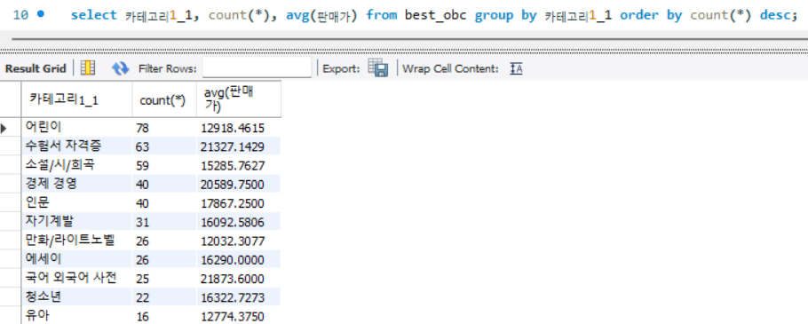
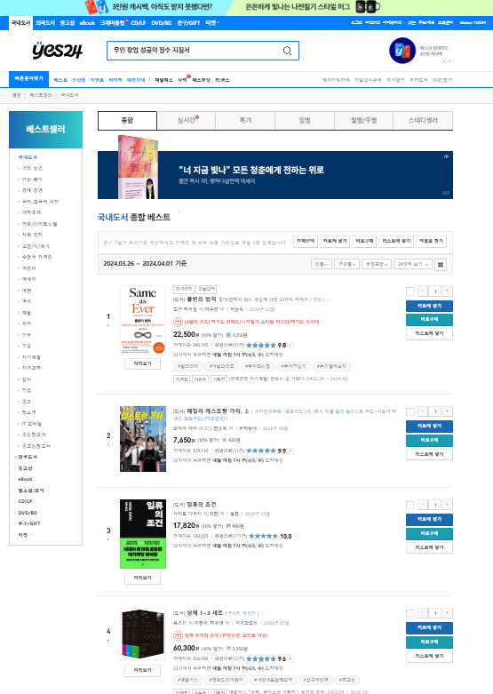
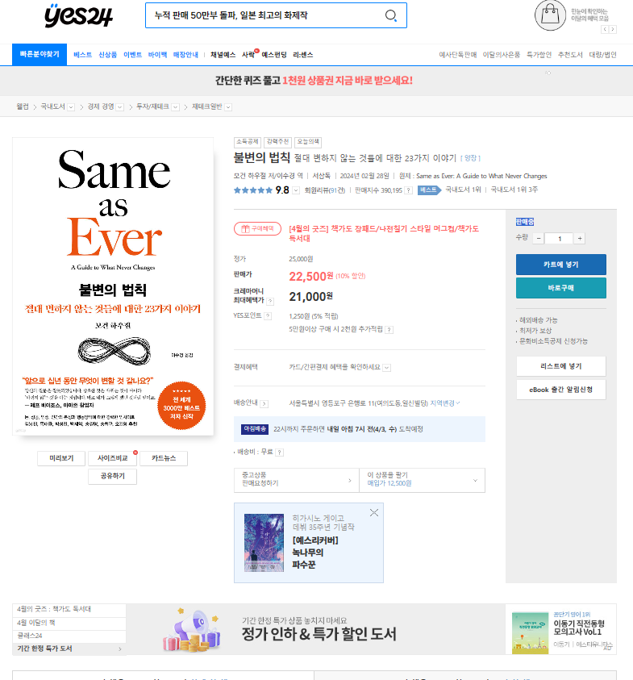
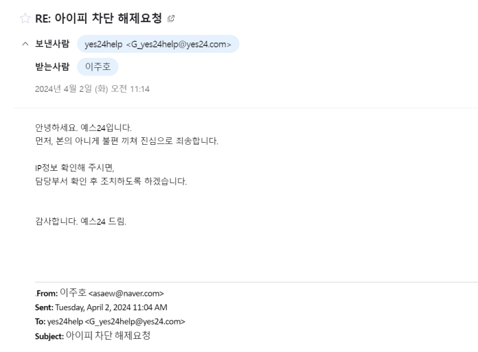
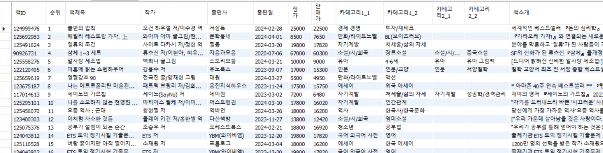

# 보고서 (SMJ팀 OBC)
## 1. 데이터 기술 보고서
### 1. 주제 
  * 주제 : Online Bookstore Crawling
      * 주제 선택 이유 
      독서율은 교과서, 참고서, 만화 등의 도서를 제외한 일반 도서를 1년 동안 1권 이상 읽은 사람의 비율을 나타내는 지표로,
      한국은 OECD 19개국 중 12위로 비교적 낮은 순위에 위치해 있다. 
      또, 각종 디지털 매체의 보급으로 해마다 독서율 및 독서량이 감소하는 추세이고, 독서 인구 간의 편차도 크다. 이에 한국인의 독서 실태를 조사하기 위해 주제를 선정했다. 
      [출처 : 문학신문 '[랭킹] OECD 국가 중 한국의 독서율은 몇 위일까?'](https://www.munhakin.kr/news/articleView.html?idxno=745)
      * 이용 계획
      
        1. 단기적 데이터 
        * 판매량이 높은 카테고리 조사
        * 책의 가격과 판매량의 상관관계 조사
        * 스테디 셀러에 오른 책들의 특징 파악
        2. 장기적 데이터 
        * 베스트 셀러에 오래 남아있는 책의 공통점 조사
        * 자주 베스트 셀러에 오르는 책을 출판하는 작가/출판사 조사
        * 책 소개에 대한 분석  
        이용 예시 : 카테고리 별 500위 안에 든 횟수와 평균 가격
       
### 2. 프로젝트 조원별 담당 업무
* 공통 : 크롤링 코드 작성 및 HTML 구조 분석
* 김문선 : csv파일 저장 및 MySQL DB와 연동 구현 
* 이서희 : 코드 개선, 문서 작성, 팀원 보조
* 이주호 : 코드 테스트-개선, 데이터 관리
### 3. 후기
개인 문서로 작성(링크)
* [김문선](후기-김문선.md)
* [이서희](후기-이서희.md)
* [이주호](후기-이주호.md)
## 2. 데이터 탐색 보고서
* 크롤링 대상 : yes24 (http://www.yes24.com
)

  ### 1. 크롤링 대상 분석
   
  베스트 셀러 메인페이지. url을 바꿔 페이지당 표시 갯수 및 조회할 페이지를 조절할 수 있다. 책 페이지의 url과 순위 또한 html을 통해 얻을 수 있다.
* 사용한 selector (변수명)
  * 순위 셀렉터 (rank_selector) : 표지 좌측에 표기된 책의 순위를 조회
  * 표지 셀렉터 (cover_selector) : 책 표지 이미지 조회. 성인 등급의 도서는 같은 이미지를 사용하므로, 이를 체크하여 배제할 수 있다.
  * 책 셀렉터 (book_selector) : bold로 표시된 책 제목을 통해 책 제목과 해당 책 소개 페이지 url을 얻을 수 있다.
  각 책에 할당된 페이지. html를 분석해 다양한 정보를 추출할 수 있다.

   
  각 책에 할당된 페이지. html를 분석해 다양한 정보를 추출할 수 있다.

  * 사용한 selector (변수명)
    * 작가/번역가 셀렉터 (auth_selector) : 작가 및 번역가를 조회할 수 있다.
    * 출판사 셀렉터 (publish_selector) : 출판사를 조회할 수 있다.
    * 출판일 셀렉터 (date_selector) : 출판일자를 조회할 수 있다.
    * 가격 셀렉터 (price_selector) : 정가/판매가를 조회할 수 있다.
    * 카테고리 셀렉터 (category_selector) : 국내도서 > 경제/경영 > 투자 재태크 와 같은 형태로 페이지에 소개된 책의 카테고리를 조회할 수 있다.
    * 책 소개 셀렉터 (introduce_selector) : 책 소개가 쓰여있는 위치를 조회할 수 있다.
  ### 2 사용 라이브러리 및 DB
  * requests : 원하는 페이지에 접근 하기 위해 사용함
  * BeautifulSoup : html 문서로부터 데이터를 얻기 위해 사용함
  * asynciom, aiohttp : 코루틴을 이용한 비동기처리로 작업시간을 줄이기 위해 사용함
  * pandas : 수집한 데이터를 DataFrame에 저장하기 위해 사용함
  * datetime, os : DataFrame을 csv파일로 저장하기 위해 사용함
  * time : 작업에 걸린 시간 측정
  * MySQL : 데이터를 저장할 DB
  * sqlalchemy : DataFrame을 MySQL DB에 저장하기 위해 사용

  ### 3. 어려웠던 점
  * 셀렉터로 얻을 수 있는 정보가 예상했던 것 보다 더 다양한 형태로, 크롤링 테스트 중 오류가 계속 반복했고 이에 맞춰 코드를 수정했다.
  * 성인 등급 도서 조회를 위한 성인 인증 문제. 로그인이 필요했는데, 이에 해당하는 대상 수가 적고 selenium을 사용하지 않는 방식으로 코드를 작성했기에 이를 수집 대상에서 제외해 해결했다.
  * 크롤링 테스트 중 페이지 차단. 짧은 시간 내에 반복적으로 사이트에 접속해 yes24로부터 IP 밴을 당했다. yes24 고객문의 메일로 문의를 보내 해결했으나, 다음부터는 sleep(), random()과 같은 함수를 이용해 접속 시간을 랜덤으로 지연시켜 차단당하지 않도록 해야할 것이다. 
  
  
  ## 3. 데이터 셋

* 크롤링한 데이터 
  .OBC/Datas 경로에 베스트셀러/월간 베스트 셀러/스테디 셀러 별로 500위까지 저장
* MySQL DB 
 
테이블 구조 
  * 책ID : URL은 https://www.yes24.com/Product/Goods/ + 숫자의 형태로 반복되는데, 이는 책마다 고유하므로 * Primary Key로 활용했다. 
  * 순위 : 데이터를 수집한 날짜 기준의 순위 
  * 작가 : 작가 및 역자
  * 출판사 : 출판사 
  * 출판일 : 연-월-일 형태로 저장
  * 정가 : 원래의 가격
  * 판매가 : 온라인 구매 가격
  * 카테고리 : 책의 카테고리는 2개 이상일 때도 있었으며, 상위 2개의 카테고리만 최대 2개씩 저장했다.
  * 책소개 : 책 소개란의 텍스트를 저장

